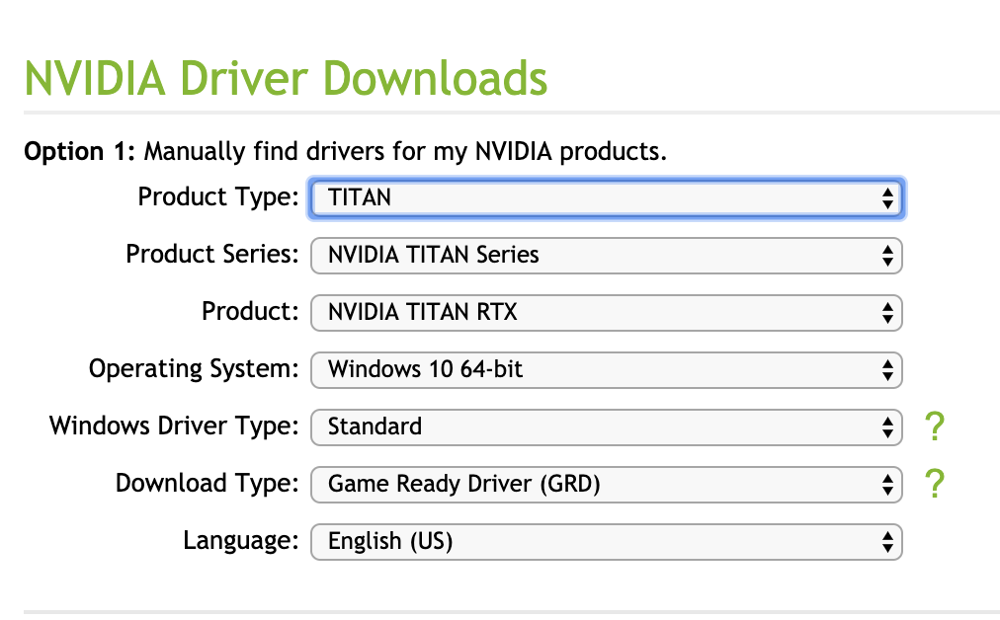

### A little background. 
We do machine learning stuff where I work. Normally we do machine learning stuff with tensorflow and the way we usually do this is we will build and train the neural net using Python.

Then, we want to convert this neural net into a product consumable by users, so we need to put it into a format accessible to the average person. Most people do not have Python installed, and most people do not use Linux as their operating system, but this is teh environment that seems to work best with Tensorflow. 

So what happens next is pretty much that we start converting all the Python code to C++, and we have to build an application to load the model on Windows, and another one that will build the model on the Mac. 

### First failed Attempt:
	Since we have to build for both Mac and Windows, an easy thing to do in this situaiton is to use some cross platform framework like Qt so that you only have to write your code once. 

	We tried getting some prebuild dlls and dylibs for tensorflow 1.14 and linking them into our project. We kept getting compiler errors about missing headers and unresolved external symbols no matter what we tried, so we determined that we might need more control, and decided to build Tensorflow ourselves. If you build the code yourself, you can find the exact line of code causing the missing header error or unresolved external symbol error and get what info you need to fix it.

### Building the Tensorflow Source code on Windows with GPU support

1. Before installing Bazel, make sure you can compile Tensorflow on your Windows machine. Read ``https://www.tensorflow.org/install/gpu#windows_setup`` to see the prereqs. You need to make sure you have a compatible graphics card.

According to the article you need: 

For example I checked my device manager under display adaptors to see what graphics card I have: 

You need to install the NVidia graphics driver for your card. You can type the name of your graphics card plus "Nvidia grpahics card driver to find the download page for your card."

You need to make sure you are downloading the latest version, in your search you may find an older version, and if you are lucky, when you run and install, you may see an error like this if your driver is too old:

But you might not be so lucky and have to find out later. 

The page for NVidia Graphics card drivers is ``https://www.nvidia.com/Download/index.aspx``

And you're going to find your graphics card using this thing:

If you don't see your graphics card in there keep looking,you are possibly looking under the wrong category. If it is an NVidia graphics card and it exists, it will be in there somewhere. If you go throiugh this form you are guaranteed to get the latest version. If you google and just find some link, there is a possibility you will download an older version, so make sure. 

 Install Bazel. I was hesitant to start using Bazel because I saw many examples using CMake, and because it was intimidating at first. However, I will say that the Bazel documentation is very good and the command line tools and syntax from Bazel are very well made, so there is no need to be scared of trying the new framework. 

The step to install Bazel are very well documented, so I will not include them in this document. You can follow them here: ``https://docs.bazel.build/versions/master/install-windows.html``
Note: I Just downloaded the bazel exe file from Github. I built tensorflow from source, but I did not need to build Bazel from source. 

 

