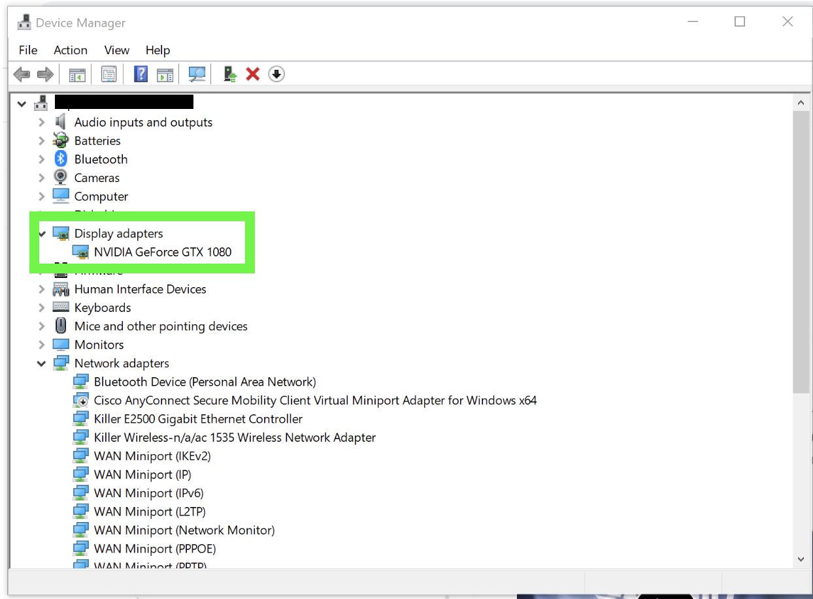
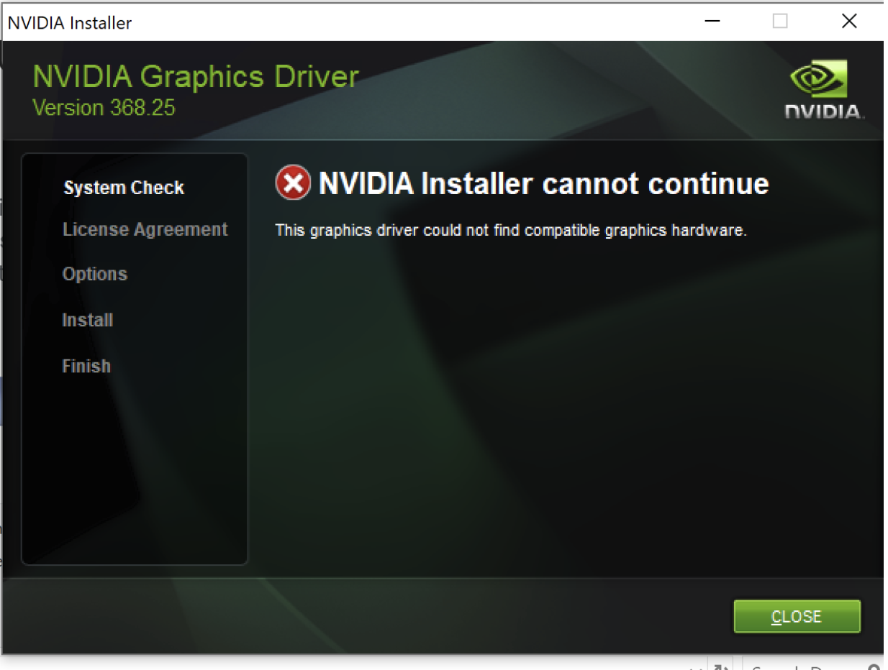
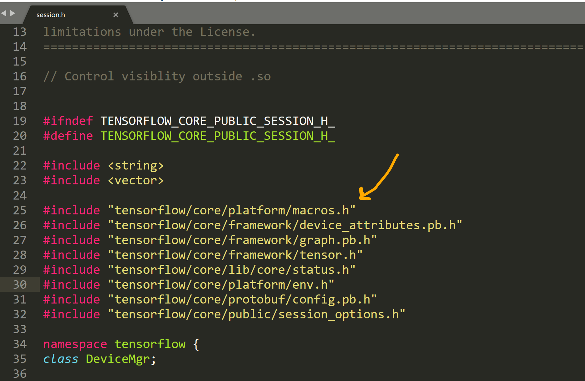

Btw if you enjoy my tutorial, I always appreciate endorsements on my LinkedIn: https://www.linkedin.com/in/ashleytharp/
Questions can go to ashley.tharp@gmail.com. I can currently check my email and attempt to assist on weekends mostly.

### Building the Tensorflow Source code on Windows in C++ with GPU support

Python version: 3.6.8 <br>
Tensorflow Version: 1.14.0 <br>
OS: Windows 10 <br>
Cuda Version: 10.2 <br>

### Step 0: Check your hardware
Before we even start we need to make sure you are running on the correct hardware. See below this screencap from the Tensorflow documentation:

That links to here: ``https://developer.nvidia.com/cuda-gpus``. You'll be able to find your card from there. 

At this time (10/11/2019), you need an NVidia GPU. You normally will not get these in a laptop unless it is a gaming laptop.  
From the documentation on ``https://www.tensorflow.org/install/gpu``


Alternatively, you can also look under Display Adaptors in the Device Manager: 
For example I checked my device manager under display adaptors to see what graphics card I have: 


### Step 1: Install NVidia Graphics Card Driver
You need to install the NVidia graphics driver for your card.
The page for NVidia Graphics card drivers is ``https://www.nvidia.com/Download/index.aspx``

And you're going to find your graphics card using this form:


If you use that form, you are guaranteed to download the latest version, if you just google for your card and find a link to an older version of the driver, if you are lucky, when you run and install, you may see an error like this if your driver is too old:


But you might not be so lucky and have to find out later. So use that form, I have made the mistake before of just using some link I found on StackOverflow and installed a driver that was outdated. Don't make my mistake :)

If you don't see your graphics card in there, keep looking, you are possibly looking under the wrong category. If it is an NVidia graphics card and it exists, it will be in there somewhere. If you go throiugh this form you are guaranteed to get the latest version. 

You will download an exe file and run it to install your NVidia graphics card driver. The one I ended up using was: ``http://us.download.nvidia.com/Windows/436.48/436.48-notebook-win10-64bit-international-whql.exe``

### Step 2: Install Cuda for Windows
The documentation is here: ``https://docs.nvidia.com/cuda/cuda-installation-guide-microsoft-windows/`` <br>
Go to here: ``https://developer.nvidia.com/cuda-downloads`` and download the NVidia Cuda Toolkit. <br>


### Step 3: Install Python for Windows
Download page: ``https://www.python.org/downloads/windows/``
Make sure you set your path variables. If you cannot call ``python --version`` from the ``cmd`` terminal you did not set your environment variables correctly yet.

Note: I am following this page from TF to get that info: https://www.tensorflow.org/install/source_windows

Once you have installed Python for Windows, also install these dependencies using pip3 in the terminal using the commands below:

```
pip3 install six numpy wheel
pip3 install keras_applications==1.0.6 --no-deps
pip3 install keras_preprocessing==1.0.5 --no-deps
```

### Step 4: Install Bazel
The documentation is on this page: ``https://docs.bazel.build/versions/master/install-windows.html``
Follow all the steps on that page and install all the prereqs.

Then you will go to this page to actually install Bazel: ``https://github.com/bazelbuild/bazel/releases/tag/0.24.1`` There are more recent versions, but 0.24 is the version you need for building Tensorflow 1.14 on Windows.

If you install the wrong version you will see something like this: 

The first time you try to build tensorflow, so make sure you have downloaded version 0.24.

### Step 5: Configure Bazel to Build C++ on Windows
Follow this documentation: ``https://docs.bazel.build/versions/master/windows.html#build-c-with-msvc``

### Step 6: Install MSYS
Go here: ``https://www.msys2.org/`` and download and install MSYS for the bin tools you will need to build Tensorflow

If MSYS2 is installed to ``C:\msys64``, ie. you installed the 64 bit version, add ``C:\msys64\usr\bin`` to your ``%PATH%`` environment variable. Then, using cmd.exe, run:
```
pacman -S git patch unzip
```

### Step 7: Install Visual Studio Build Tools 2017
Documentation is here: ``https://www.tensorflow.org/install/source_windows#install_visual_c_build_tools_2017``
Note: I have done this with MSVC 2015 with no problems, so that might work for you too.

### Step 8: Clone the Tensorflow source code
Original Documentation: ``https://www.tensorflow.org/install/source_windows#download_the_tensorflow_source_code``

``cd`` into your cloned directory and do ``git checkout r1.14``

### Step 9: Configure the Build using configure.py
Original Documentation: ``python ./configure.py``
Run ``python ./configure.py`` at the root of your source tree

You will probably want to say no to all the other dependencies it asks you about (unless you are specifically aware that your project needs it), but you should say yes when it asks you if you want to build with Cuda. A successful session will look something like this: 
```
$ python configure.py
WARNING: --batch mode is deprecated. Please instead explicitly shut down your Bazel server using the command "bazel shutdown".
You have bazel 0.24.1 installed.
Please specify the location of python. [Default is C:\Users\Username\AppData\Local\Programs\Python\Python36\python.exe]:


Found possible Python library paths:
  C:\Users\Username\AppData\Local\Programs\Python\Python36\lib\site-packages
Please input the desired Python library path to use.  Default is [C:\Users\Username\AppData\Local\Programs\Python\Python36\lib\site-packages]

Do you wish to build TensorFlow with XLA JIT support? [y/N]:
No XLA JIT support will be enabled for TensorFlow.

Do you wish to build TensorFlow with ROCm support? [y/N]:
No ROCm support will be enabled for TensorFlow.

Do you wish to build TensorFlow with CUDA support? [y/N]: Y
CUDA support will be enabled for TensorFlow.

Found CUDA 10.0 in:
	C:/Program Files/NVIDIA GPU Computing Toolkit/CUDA/v10.0/lib/x64
	C:/Program Files/NVIDIA GPU Computing Toolkit/CUDA/v10.0/include
Found cuDNN 7 in:
	C:/Program Files/NVIDIA GPU Computing Toolkit/CUDA/v10.0/lib
	C:/Program Files/NVIDIA GPU Computing Toolkit/CUDA/v10.0/include

``` 

### Step 10: Build the dll 
Note: Dont do this:
```
bazel build //tensorflow/tools/pip_package:build_pip_package
```
This is on the ``https://www.tensorflow.org/install/source_windows`` but this is building Python stuff, you don't want that. You want the C++ API for tensorflow so disregard that.

```
bazel build --config=cuda tensorflow:tensorflow.dll
```
The build will take a long time (possibly between 20 minutes and an hour the first time)

### Step 11: Build the .lib
```
bazel build --config=cuda tensorflow:tensorflow.lib
```
The build may take a long time (possibly between 20 minutes and an hour the first time)

### Step 12: Link your .lib into your Windows project for testing
You may do this in Visual Studio, or Qt for example. Add a path to your .lib file and test compilation calling a tensorflow function in your c++.

### Step 13: Add Header source if necessary
On my build I had trouble with these libs so I downloaded their source code separately and linked them into my project. <br>
Clone these header libraries from Github or download the source from these 3 places: 
```
https://github.com/protocolbuffers/protobuf/releases/tag/v3.7.0 
https://github.com/abseil/abseil-cpp 
http://eigen.tuxfamily.org/index.php?title=Main_Page 
``` 
and link them into your Windows project if you are having trouble with missing header files or recursive includes of headers in the eigen library.


### Step 14: Identify Missing Symbols:
You have built your .libs and .dll files. Now you should make a small C++ project to test using these libraries. Probably one of the first things you will want to do is just some very very basic tensorflow setup code like this: 
```
#include "tensorflow/cc/ops/standard_ops.h"
#include <tensorflow/core/framework/graph.pb.h>
#include "tensorflow/core/graph/default_device.h"
#include "tensorflow/core/graph/graph_def_builder.h"
#include "tensorflow/core/lib/core/threadpool.h"
#include "tensorflow/core/lib/strings/stringprintf.h"
#include "tensorflow/core/platform/init_main.h"
#include "tensorflow/core/platform/logging.h"
#include "tensorflow/core/platform/types.h"
#include "tensorflow/core/public/session.h"
#include "tensorflow/core/protobuf/meta_graph.pb.h"
#include "tensorflow/core/framework/graph.pb.h"
#include "tensorflow/core/public/session.h"
#include "tensorflow/core/framework/tensor.h"

using namespace tensorflow;

int main(int argc, char *argv[]) {
	// Create a Session running TensorFlow locally in process.
	std::unique_ptr<tensorflow::Session> session(tensorflow::NewSession({}));

	return 0;
}
```

Probably you will see some complaints about unresolved external symbols like this:
For each compilation error you see like this: 


The reason this is happening is because you can only expose 60,000 symbols in a dll. This is just some limitation of the dll format. The tensorflow library code has more than 60000 symbols, so as the programmer building this dll (a dll is just a binary file for accessing a library at runtime) you will have to manually indicate which symbols you want exposed if they are not already. Google has chosen some default set, but it may not work for everyone.

Note: For our intents and purposes here, just think of a missing symbol error as pointing out that the compiler can't find the actual definition of some class or function anywhere. What we are going to do is to expose the missing symbol so that the compiler can find it. 

Go to the source code that has the missing symbol error. In your IDE you may be able to right click the symbol reference in your actual code and select "Go to Symbol Definition" or something similiar. 
I am using Qt Creator for my C++ project code and it looks like this: 


This will take you into somewhere in the actual tensorflow source code. (in this case tensorflow-master\tensorflow\core\public\session.h) In front of the function definition or the class definition that caused the missing symbol error put the macro ``TF_EXPORT``, at the top of that same file, before any other includes put ``#include "tensorflow/core/platform/macros.h"`` 




In ``\tensorflow\tensorflow\core\public\session.h`` you will add ``TF_EXPORT`` to the constructor definition of Session. 
When you are done, it will look like this: 
```
...
/// ```
///
/// A Session allows concurrent calls to Run(), though a Session must
/// be created / extended by a single thread.
///
/// Only one thread must call Close(), and Close() must only be called
/// after all other calls to Run() have returned.
class Session {
 public:
  TF_EXPORT Session();
  virtual ~Session();

  /// \brief Create the graph to be used for the session.
  ///
  /// Returns an error if this session has already been created with a
  /// graph. To re-use the session with a different graph, the caller
  /// must Close() the session first.
  virtual Status Create(const GraphDef& graph) = 0;
  ...
```


You will probably also need to export the symbol for NewSession, so you will add ``TF_EXPORT`` to the symbol definition and it will look like this:
```
TF_EXPORT Status NewSession(const SessionOptions& options, Session** out_session);
```

May also want to add ``TF_EXPORT`` in front of this function as well:
```
TF_EXPORT Session* NewSession(const SessionOptions& options);


```
In your Tensorflow code again you may also need to export two symbols in ``/tensorflow/core/public/session_options.h``
Your final ``session_options.h`` file will look like this: 

```
/* Copyright 2015 The TensorFlow Authors. All Rights Reserved.

Licensed under the Apache License, Version 2.0 (the "License");
you may not use this file except in compliance with the License.
You may obtain a copy of the License at

    http://www.apache.org/licenses/LICENSE-2.0

Unless required by applicable law or agreed to in writing, software
distributed under the License is distributed on an "AS IS" BASIS,
WITHOUT WARRANTIES OR CONDITIONS OF ANY KIND, either express or implied.
See the License for the specific language governing permissions and
limitations under the License.
==============================================================================*/

#ifndef TENSORFLOW_PUBLIC_SESSION_OPTIONS_H_
#define TENSORFLOW_PUBLIC_SESSION_OPTIONS_H_

#include <string>
#include "tensorflow/core/platform/types.h"
#include "tensorflow/core/protobuf/config.pb.h"
#include "tensorflow/core/platform/macros.h"

namespace tensorflow {

class Env;

/// Configuration information for a Session.
TF_EXPORT struct SessionOptions {
  /// The environment to use.
  Env* env;

  /// \brief The TensorFlow runtime to connect to.
  ///
  /// If 'target' is empty or unspecified, the local TensorFlow runtime
  /// implementation will be used.  Otherwise, the TensorFlow engine
  /// defined by 'target' will be used to perform all computations.
  ///
  /// "target" can be either a single entry or a comma separated list
  /// of entries. Each entry is a resolvable address of the
  /// following format:
  ///   local
  ///   ip:port
  ///   host:port
  ///   ... other system-specific formats to identify tasks and jobs ...
  ///
  /// NOTE: at the moment 'local' maps to an in-process service-based
  /// runtime.
  ///
  /// Upon creation, a single session affines itself to one of the
  /// remote processes, with possible load balancing choices when the
  /// "target" resolves to a list of possible processes.
  ///
  /// If the session disconnects from the remote process during its
  /// lifetime, session calls may fail immediately.
  string target;

  /// Configuration options.
  ConfigProto config;

  TF_EXPORT SessionOptions();
};

}  // end namespace tensorflow

#endif  // TENSORFLOW_PUBLIC_SESSION_OPTIONS_H_

```

and then rebuild your .lib. Tensorneeds to be built with that symbol exported. Just calling ``bazel build --config=cuda tensorflow:tensorflow.lib`` will suffice, there is no need to do a clean rebuild.

### On collaboration with me to get your Windows tensorflow build working or suggesting edits to this document
You can email me at ashley.tharp@gmail.com. I try to check my email and clear my inbox every day. I will have most active time to work on collabs on weekends as this is a side project for me.

I found the tensorflow code is not easy to just zip up and transport to another computer because the code has many symbolic links in it. I also do not know how to commit to Github such type of code with these links in it, so I have found an easy solution for quick collab is to use some screensharing software. 
One person gave me once his version of bazel, python, tensorflow and so on, and this is good enough for me to try to copy your environment, but configuration is quite time consuming. I think this fact is perhaps why Docker was invented. 


